## Задача 1

ссылка на репо
https://hub.docker.com/r/qdos/custom-nginx/

## Задача 2

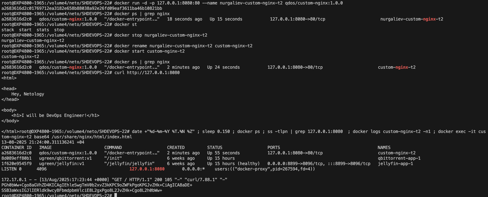

## Задача 3

подключение к контейнеру через attach
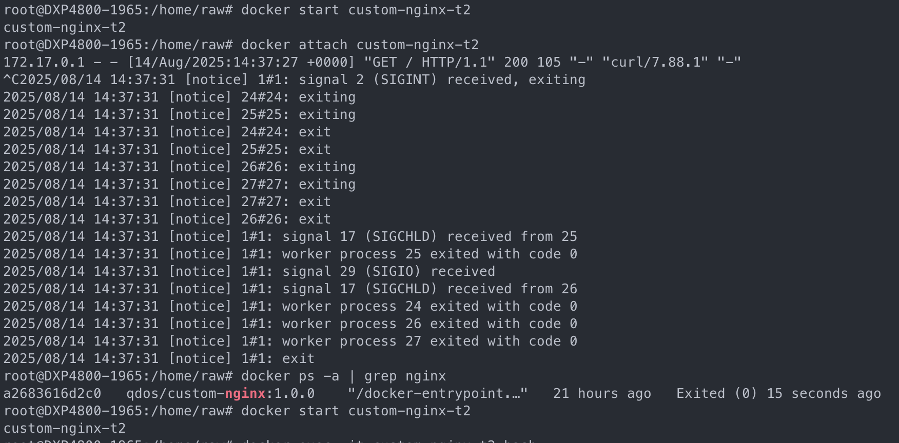
контейнер останавливается, т.к. при выходе через ctrl+c останавливаем основной процесс

порты nginx
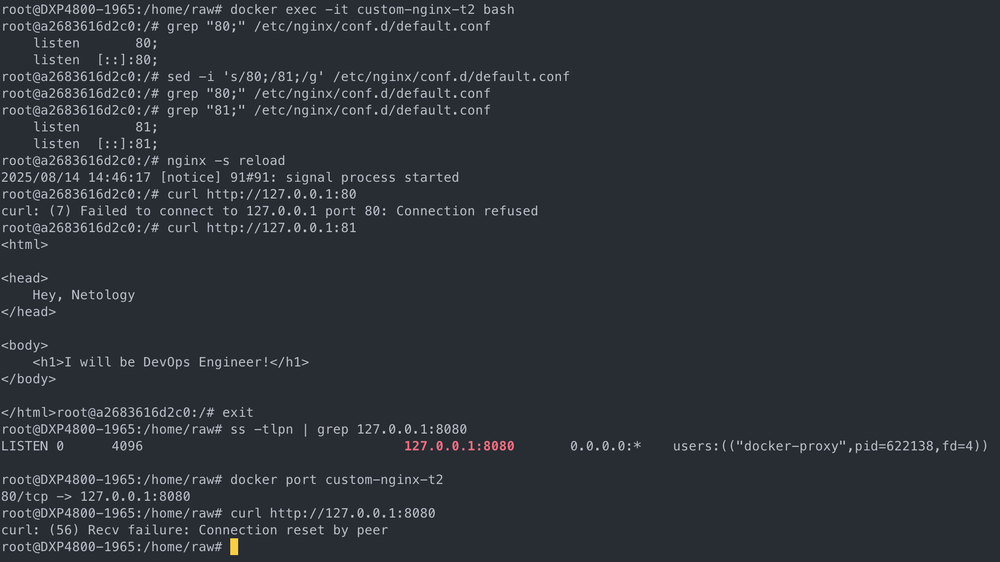
исправил конфиг с помощью sed, т.к. он уже имеется в контейнере
после изменения порта, примапленый ранее порт nginx не слушает, и не отвечает при запросе на порт 8080 хостовой машины

остановка докер
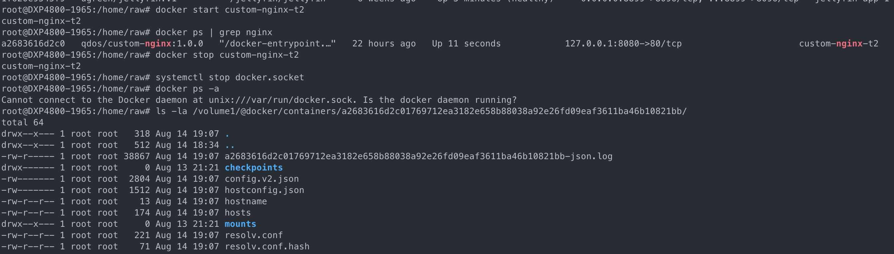
правка файлов с параметрами контейнера
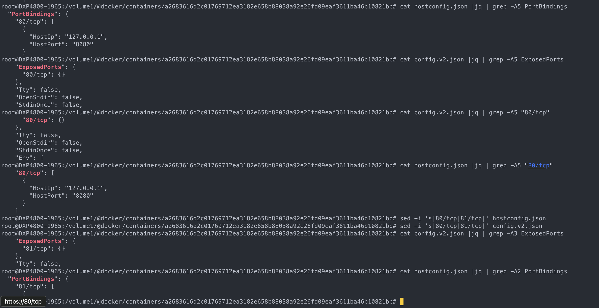
запуск контейнера с исправленным маппингом порта
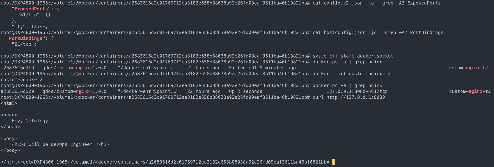

форсировано удаляем контейнер через флаг -f без предварительной остановки
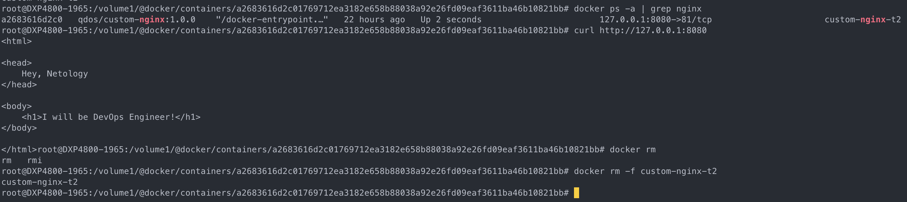

## Задача 4

запуск контейнеров
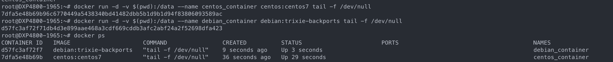
создание файлов и проверка наличия
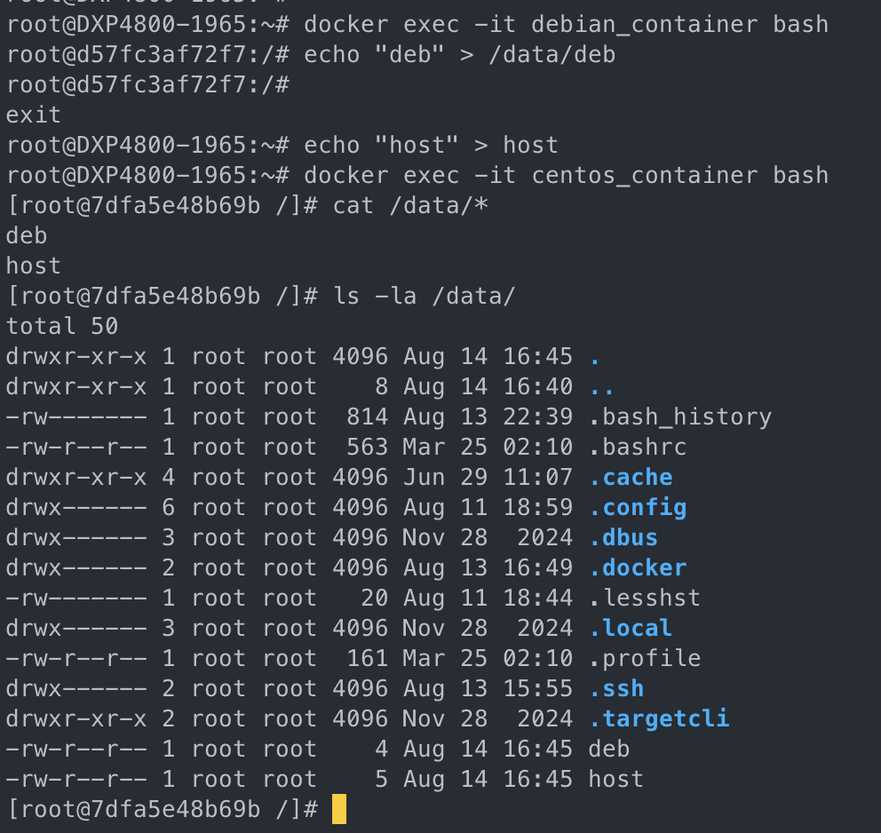

## Задача 5

При запуске без явного указания файла манифеста, приоритет имеет compose.yml
содержимое compose.yml
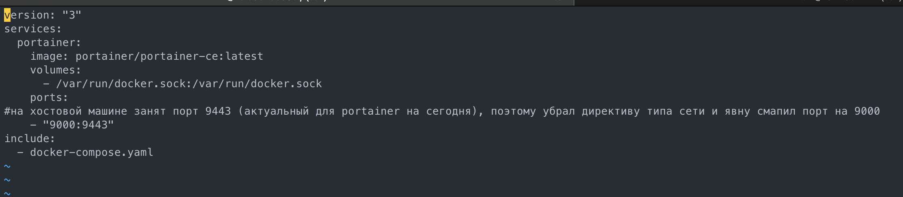

запуск compose, пуш custom nginx

задеплоеный nginx через portainer
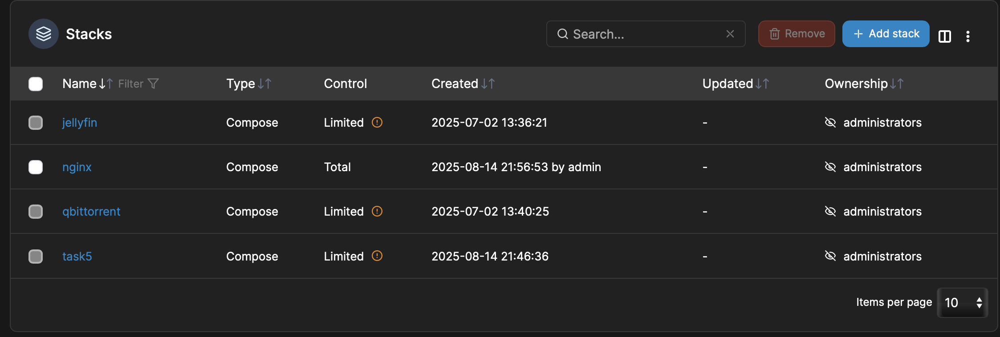
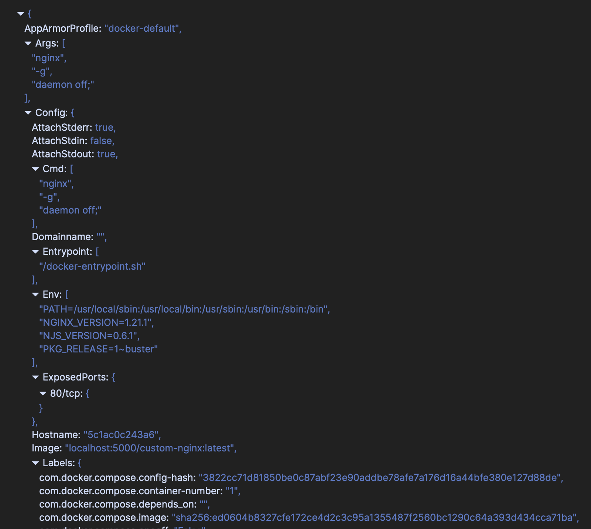
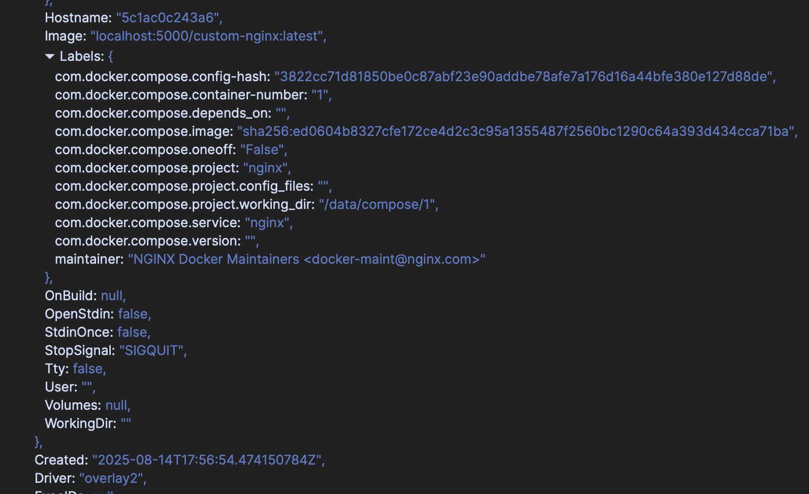

