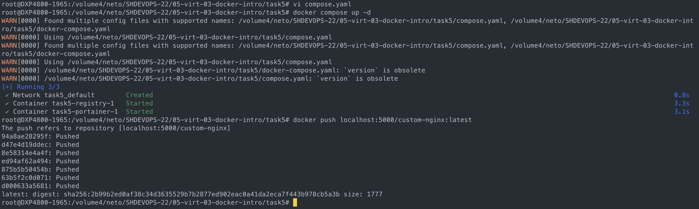

## Задача 1

https://hub.docker.com/r/qdos/custom-nginx/

## Задача 2

## Задача 3

контейнер останавливается, тю.к. при выходе через ctrl+c останавливаем основной процесс

исправил конфиг с помощью sed, т.к. он уже имеется в контейнере
после изменения порта, примапленый ранее порт nginx не слушает, и не отвечает при запросе на порт 8080 хостовой машины

## Задача 4

## Задача 5

При запуске без явного указания файла манифеста, приоритет имеет compose.yml

