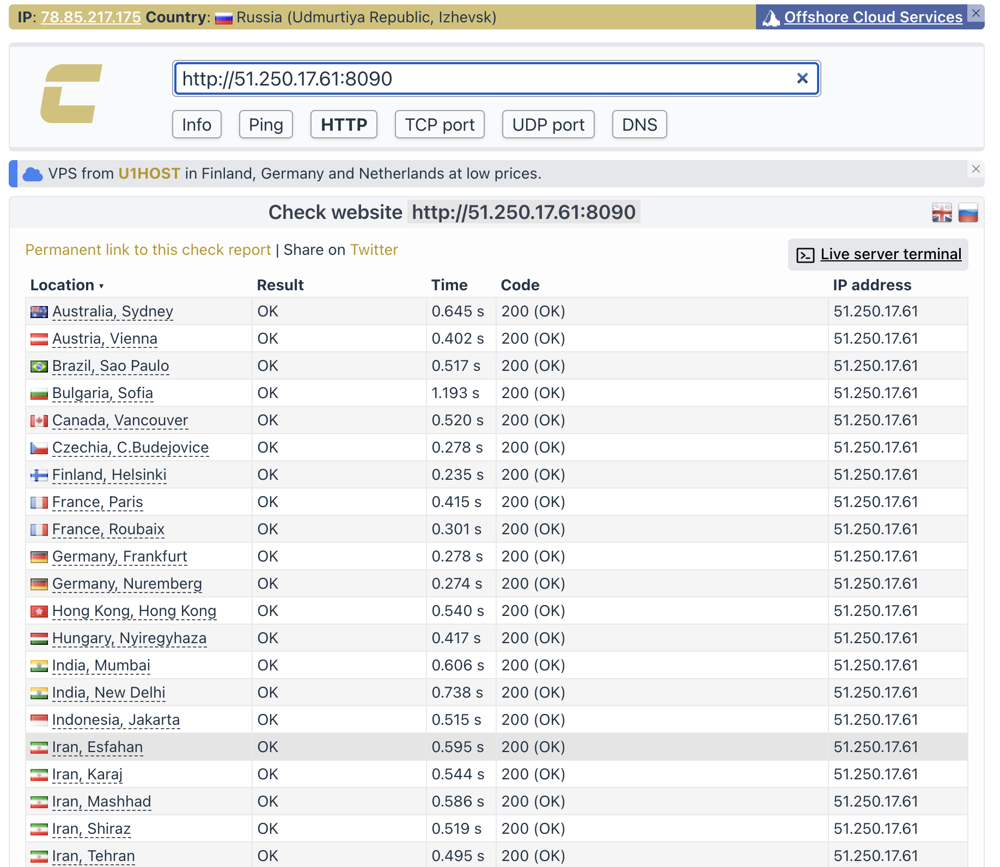
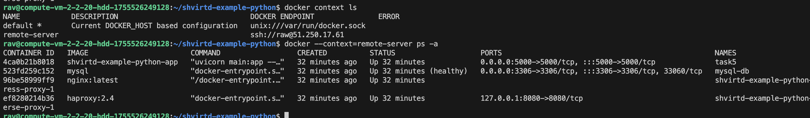
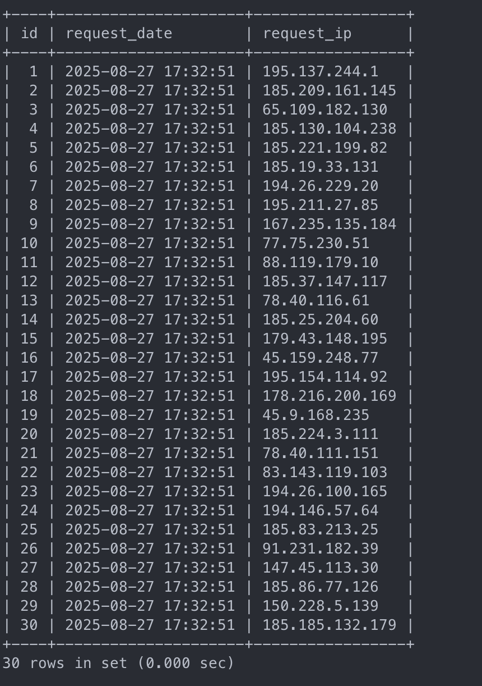
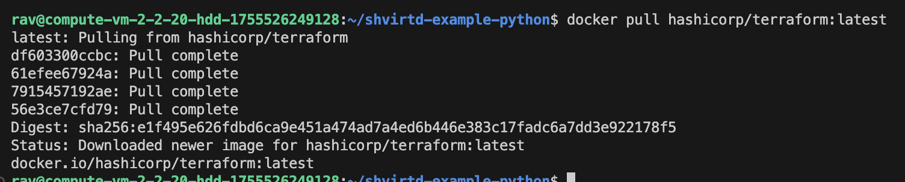
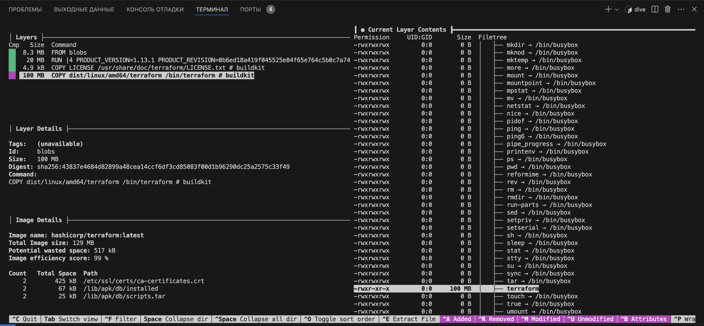
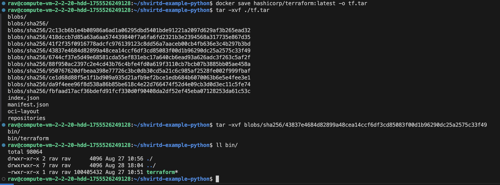
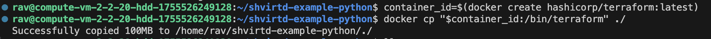

## Задача 0

## Задача 1
https://github.com/rnurgaliev/shvirtd-example-python

## Задача 2 (*)

## Задача 3

## Задача 4
bash-скрипт - https://github.com/rnurgaliev/shvirtd-example-python/blob/main/task4.sh

https://github.com/rnurgaliev/shvirtd-example-python

## Задача 5 (*)
Не удалось выполнить бекап с помощью schnitzler/mysqldump:latest - отсутсвует плагин, добивать не стал, не укладываюсь в дедлайн

mysqldump: Got error: 1045: "Plugin caching_sha2_password could not be loaded: Error loading shared library /usr/lib/mariadb/plugin/caching_sha2_password.so: No such file or directory" when trying to connect

## Задача 6

## Задача 6.1

